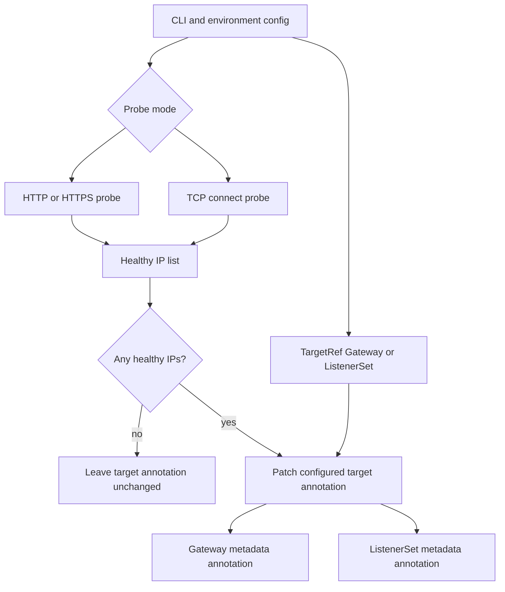
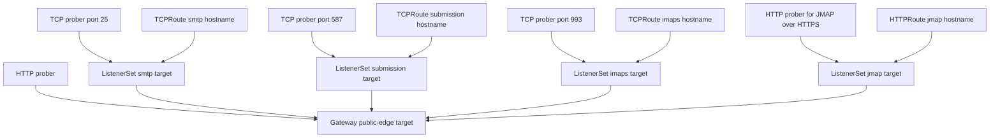

# TCP ListenerSet Health Probing - Plan

## Goal Capsule

| Field | Content |
|---|---|
| Objective | Refactor `gateway-target-prober` so each DNS target object can be controlled by either the existing HTTP/S health check or a generic TCP-connect health check, with existing Gateway-wide HTTP/S behavior preserved. |
| Authority | Preserve the confirmed Product Contract first, existing operator compatibility second, and local code simplicity third. |
| Execution profile | Code implementation in this repo, plus operator documentation for Gateway API, Envoy Gateway, and ExternalDNS setup. |
| Stop conditions | Stop before implementation changes if a required behavior would reintroduce shared `mail.*` targets, XListenerSet support, protocol-aware mail handshakes, or combined HTTP+TCP checks. |
| Tail ownership | The implementation step must satisfy the Verification Contract and leave no abandoned refactor scaffolding in the diff. |

---

## Product Contract

### Summary

Plan a one-target, one-mode controller shape: HTTP/S can continue patching the shared Gateway target annotation, while non-HTTP services such as SMTP, submission, and IMAPS can each get their own standard Gateway API ListenerSet target controlled by generic TCP-connect checks.
Each non-HTTP target is updated independently, so an unhealthy edge IP is withdrawn only from the DNS records attached to that target.

### Problem Frame

The current controller patches one Gateway annotation after an HTTP/S health check.
That is correct for the existing HTTP/S ingress deployment, where all Gateway-derived web records intentionally share the same target list.

Non-HTTP services need a separate target source.
When SMTP, submission, IMAPS, and HTTP/S records all use one Gateway target annotation, one prober's health decision affects every DNS name whose target ExternalDNS resolves from that Gateway.
That means a web health check can keep publishing an IP for SMTP, or a TCP prober can overwrite web records, unless the DNS target source is split.

The durable split remains a standard ListenerSet per non-HTTP target.
The health signal for this implementation is generic TCP-connect rather than protocol-aware SMTP, submission, IMAPS, or JMAP handshakes.

### Actors

- A1. Cluster operator: configures probers, Gateway API objects, ExternalDNS, and DNS hostname conventions.
- A2. gateway-target-prober: probes candidate public IPs and patches exactly one configured target object.
- A3. ExternalDNS: derives hostnames from Routes and target IPs from Gateway or ListenerSet annotations.
- A4. Edge clients: web and non-HTTP service clients that depend on DNS records matching service reachability.

### Requirements

**Compatibility**

- R1. Preserve the existing Gateway-wide HTTP/S deployment shape using `--gateway-name`, `--gateway-namespace`, `--annotation-key`, `--ips`, `--host-header`, `--http-path`, and `--http-scheme`.
- R2. Preserve the fail-safe rule: when no candidate IP is healthy for the configured probe, do not patch an empty target list.
- R3. Preserve annotation-key configurability because current clusters may still use `external-dns.alpha.kubernetes.io/target` while newer ExternalDNS documentation also shows non-alpha annotation keys.

**Target Scoping**

- R4. Support patching a standard `gateway.networking.k8s.io/v1` `ListenerSet` target annotation in addition to the current Gateway target annotation.
- R5. Treat Gateway target annotations as object-wide and ListenerSet target annotations as the service-specific target source.
- R6. Do not use Route-level `target` annotations for service-specific target lists because ExternalDNS Gateway API source ignores target annotations on Routes.
- R7. Do not support current-cluster `XListenerSet` as a first-class contract path.

**Health Modes**

- R8. Replace combined HTTP/S+TCP health with one selected probe mode per process.
- R9. Provide `http` and `tcp` probe modes.
- R10. Keep `http` mode as the default and preserve the existing HTTP/S 2xx success rule.
- R11. In `tcp` mode, require one or more configured TCP ports and mark an IP healthy only when a TCP connection succeeds for every configured port.
- R12. Do not implement protocol-aware SMTP, submission, IMAPS, or JMAP probes at this point.

**DNS Identity**

- R13. Treat service hostnames as configurable operator choices, with examples such as `smtp.<domain>`, `submission.<domain>`, `imap.<domain>` or `imaps.<domain>`, and `jmap.<domain>` when JMAP remains HTTP/S.
- R14. Do not keep `mail.*` as the permanent shared hostname after cutover when independent service target withdrawal is required; route annotations, certificates, workload public URLs, MX/client docs, and monitoring references must migrate to service-specific identities.
- R15. Ensure the existing HTTP/S prober only controls HTTP/S records, while separate TCP probers control only their configured ListenerSet targets.

### Key Flows

- F1. Existing HTTP/S Gateway-wide control: the operator runs the current args against a Gateway, the controller probes the configured HTTP/S health endpoint for each candidate IP, and the Gateway target annotation is patched only when at least one IP is healthy.
- F2. TCP ListenerSet control: the operator runs one prober per non-HTTP ListenerSet, the controller attempts TCP connections to the configured port or ports for each candidate IP, and only that ListenerSet target annotation is patched.
- F3. Independent failure handling: if one IP fails TCP port 25 but passes HTTP/S, the SMTP ListenerSet removes that IP while the HTTP/S Gateway target can still keep it.
- F4. Fail-safe blackout prevention: if every candidate IP fails one TCP target, the target annotation remains unchanged instead of being cleared.

### Acceptance Examples

- AE1. Given the existing HTTP/S args and two healthy IPs, when the controller runs in default mode, then it patches the configured Gateway annotation with those two IPs and does not require any ListenerSet flags.
- AE2. Given an SMTP ListenerSet target with three candidate IPs and `--probe-mode=tcp --tcp-ports=25`, when one IP does not accept TCP connections on port 25, then only the SMTP ListenerSet target drops that IP.
- AE3. Given an IMAPS ListenerSet target with `--probe-mode=tcp --tcp-ports=993`, when an IP accepts TCP connections on port 993, then the IP is healthy for this scope even though no IMAP protocol greeting is validated.
- AE4. Given a TCP target configured with multiple ports, when any configured port is unreachable for an IP, then that IP is omitted from the patched target list.
- AE5. Given all candidate IPs fail a configured HTTP or TCP check, when the controller ticks, then the previous target annotation remains unchanged.
- AE6. Given a TCPRoute remains parented directly to the shared Gateway, when ExternalDNS processes it, then it still receives the Gateway target list and is not isolated by running another prober.

### Scope Boundaries

- No combined HTTP/S plus TCP or HTTP/S plus mail checks.
- No protocol-aware SMTP, IMAP, STARTTLS, or JMAP handshakes in this implementation.
- No DNS provider API writes; the controller continues to update ExternalDNS target annotations.
- No in-repo migration of external cluster manifests; this repo adds code, RBAC, and documentation so operators can migrate their manifests.
- No authenticated SMTP, IMAP login, mail delivery, or JMAP session validation.

#### Deferred to Follow-Up Work

- Protocol-aware SMTP, submission, IMAPS, POP3, POP3S, SMTPS, or custom probes.
- Multi-target configuration in one process.
- Direct cluster-manifest migration PRs for operator repositories.

---

## Planning Contract

### Product Contract Preservation

No requirements-only unified plan exists for this scope.
This revision records the updated decision that generic TCP-connect is acceptable for non-HTTP services, while preserving the ListenerSet target split and the existing HTTP/S compatibility contract.

### Key Technical Decisions

- KTD1. One process patches one target object. This keeps ownership clear and prevents a single controller instance from mixing unrelated DNS target contracts.
- KTD2. ListenerSet is the durable per-service target object. A dedicated service Gateway can be an operator workaround, but the product contract should align with standard ListenerSet because it shares the same Gateway data plane while giving ExternalDNS a separate target annotation.
- KTD3. Target patching should use a small target abstraction. Gateway remains the compatibility path, and ListenerSet can be patched through unstructured Kubernetes metadata if the typed Gateway API dependency lags the standard ListenerSet Go types.
- KTD4. New target flags are `--target-kind=gateway|listenerset`, `--target-name`, and `--target-namespace`, with `--gateway-name` and `--gateway-namespace` preserved as Gateway aliases.
- KTD5. Probe mode is a typed configuration value with `http` as the default and `tcp` as the non-HTTP mode.
- KTD6. TCP mode uses the existing `--tcp-ports` shape, but only when `--probe-mode=tcp` is set. In TCP mode every configured port must accept a connection for the IP to be healthy.
- KTD7. A non-empty `--tcp-ports` value without `--probe-mode=tcp` must fail configuration with a migration message, because combined HTTP/S+TCP behavior is out of scope.
- KTD8. TCP-connect is a reachability signal, not a protocol correctness signal. Documentation must call out that proxies, SYN proxies, or firewall-side accepts can make TCP connect succeed while the backend protocol is still unhealthy.

### High-Level Technical Design

### Dependencies and Prerequisites

- Gateway API standard ListenerSet requires Gateway API v1.5 or newer CRDs.
- ExternalDNS must support Gateway API ListenerSet target annotations and run with `--gateway-listener-sets`.
- ExternalDNS RBAC must include `listenersets` under `gateway.networking.k8s.io`.
- Envoy Gateway must run a version and feature configuration that supports standard ListenerSet; the inspected operator manifests are on Envoy Gateway 1.6.0, so they need an upgrade before ListenerSet manifests can be the durable deployment path.
- Current ExternalDNS manifests inspected in the operator repo use v0.20.0 and do not enable `--gateway-listener-sets`, so those manifests need an ExternalDNS upgrade and argument/RBAC changes before service ListenerSet DNS can work.
- Source allowlists can block TCP probes; documentation must state that the prober source has to be allowed for any protected public port.

### Assumptions

- The implementation will keep this as a small Go CLI/controller rather than introducing a multi-package framework unless tests show `main.go` becomes unmaintainable.
- Service hostnames remain operator-configurable; docs use concrete examples but code does not hard-code naming conventions.
- ListenerSet patching only needs metadata annotation updates, so unstructured patching is acceptable if typed ListenerSet support would force a large dependency jump.

### Alternative Approaches Considered

- Keep one shared `mail.*` hostname: rejected because independent service target withdrawal cannot be represented with one shared DNS identity and one shared target annotation.
- Patch Route `target` annotations: rejected because ExternalDNS Gateway API source reads targets from Gateway or ListenerSet resources, not Routes.
- Support XListenerSet: rejected because the contract is for the future standard ListenerSet path and should not bake experimental names into the CLI.
- Implement protocol-aware handshakes now: deferred because generic TCP-connect is sufficient for the current scope and keeps the release smaller.
- Add a dedicated service Gateway as the primary plan: rejected for the durable contract because it can create data-plane/hostPort conflicts and loses the standard shared-Gateway ListenerSet model.

### Sources and Research

- Current implementation and tests: `main.go`, `main_test.go`.
- Current RBAC: `rbac.yaml`.
- Existing docs and prior plan: `docs/generic-tcp-probing.md`, `docs/plans/2026-06-19-001-refactor-probe-modes-plan.md`.
- ExternalDNS Gateway API docs for ListenerSet target precedence and `--gateway-listener-sets`: https://github.com/kubernetes-sigs/external-dns/blob/v0.21.0/docs/sources/gateway-api.md.
- ExternalDNS annotation docs for `target`, `hostname`, and `gateway-hostname-source`: https://kubernetes-sigs.github.io/external-dns/latest/docs/annotations/annotations/.
- Gateway API ListenerSet guide for parent Gateway attachment and Route `parentRefs`: https://gateway-api.sigs.k8s.io/guides/user-guides/listener-set/.
- Gateway API v1.5 release note showing ListenerSet promoted to the Standard channel: https://kubernetes.io/blog/2026/04/21/gateway-api-v1-5/.
- Envoy Gateway v1.8 release notes showing bundled Gateway API CRDs v1.5.1: https://gateway.envoyproxy.io/news/releases/notes/v1.8.0/.
- Envoy Gateway TCP routing docs for TCPRoute support: https://gateway.envoyproxy.io/latest/tasks/traffic/tcp-routing/.

---

## Implementation Units

### U1. Characterize Compatibility and Retire Combined Checks

- **Goal:** Lock the current Gateway-wide HTTP/S contract before changing internals, and remove combined HTTP/S plus TCP as an active behavior.
- **Requirements:** R1, R2, R3, R8, R10, AE1, AE5.
- **Dependencies:** None.
- **Files:** `main.go`, `main_test.go`.
- **Approach:** Add config and runner characterization tests around the current HTTP/S args, fail-safe patch refusal, annotation key preservation, and `--host-header` behavior. Change the current `--tcp-ports` behavior from "HTTP must pass, then all TCP ports must pass" into TCP-only behavior that is valid only with `--probe-mode=tcp`.
- **Execution note:** Start with characterization tests before refactoring `Runner.HealthyIPs`; this area already has behavior that the operator depends on.
- **Patterns to follow:** Existing `TestConfig_*`, `TestRunner_PatchesGatewayAnnotation`, and `TestRunner_RefusesToPatchWhenAllUnhealthy`.
- **Test scenarios:**
  - Existing HTTP/S args load successfully with default probe mode `http` and target kind Gateway.
  - Existing HTTP/S runner patches the Gateway annotation with only HTTP 2xx IPs.
  - Missing all healthy IPs leaves the existing annotation unchanged.
  - `--annotation-key` continues to control the patched annotation key.
  - Non-empty `--tcp-ports` without `--probe-mode=tcp` fails configuration with a migration message.
- **Verification:** Existing HTTP/S tests still pass, and no test asserts combined HTTP/S plus TCP success.

### U2. Add Gateway and ListenerSet Target Abstraction

- **Goal:** Let the runner patch either the existing Gateway target annotation or a standard ListenerSet target annotation without duplicating probe logic.
- **Requirements:** R2, R3, R4, R5, R6, R7, AE1, AE5, AE6.
- **Dependencies:** U1.
- **Files:** `main.go`, `main_test.go`, `rbac.yaml`.
- **Approach:** Introduce a target reference model with `gateway` as the default target kind and `listenerset` as the standard service-specific target kind. Keep `--gateway-name` and `--gateway-namespace` as compatibility aliases for Gateway targets, and add `--target-kind`, `--target-name`, and `--target-namespace` for ListenerSet and future target selection. Patch metadata annotations through a shared patcher, using the typed Gateway object for the existing path and unstructured metadata patching for ListenerSet if needed.
- **Patterns to follow:** Existing `applyHealthy` no-op comparison and `normalizeIPList` behavior.
- **Test scenarios:**
  - Gateway target patch preserves the existing annotation update behavior.
  - ListenerSet target patch updates only the configured ListenerSet annotation.
  - Nil annotations are initialized before patching either target kind.
  - Existing annotation with the same normalized IP list is a no-op for both target kinds.
  - A missing target object returns a contextual error without clearing annotations.
  - RBAC includes `listenersets` only in addition to existing Gateway permissions.
- **Verification:** Fake Kubernetes client tests cover both target kinds, and `rbac.yaml` grants the minimum additional ListenerSet metadata patch permissions.

### U3. Define HTTP and TCP Probe Mode Configuration

- **Goal:** Add explicit probe mode configuration that selects either HTTP/S or TCP-connect evaluation per process.
- **Requirements:** R8, R9, R10, R11, R12, R13, R15.
- **Dependencies:** U1.
- **Files:** `main.go`, `main_test.go`.
- **Approach:** Add `--probe-mode=http|tcp` as a typed value with `http` as the default. Keep existing HTTP path, scheme, and host-header flags for HTTP mode. In TCP mode, require non-empty `--tcp-ports`, ignore HTTP-only settings, and validate every port is in range.
- **Patterns to follow:** Existing flag/env parsing helpers, `parseTCPPorts`, and table-driven config tests.
- **Test scenarios:**
  - Omitted probe mode defaults to `http`.
  - `--probe-mode=tcp --tcp-ports=25` loads successfully without HTTP-specific flags.
  - `--probe-mode=tcp` without ports fails config loading.
  - Invalid mode and invalid ports fail config loading.
  - HTTP mode accepts existing HTTP path, scheme, and host-header flags.
  - HTTP mode rejects non-empty `--tcp-ports`.
- **Verification:** Config tests cover flag and environment-variable precedence for probe mode and TCP ports.

### U4. Split HTTP/S and Generic TCP Probe Evaluators

- **Goal:** Replace the HTTP-first health path with separate HTTP/S and TCP-connect evaluators.
- **Requirements:** R8, R9, R10, R11, R12, AE2, AE3, AE4.
- **Dependencies:** U3.
- **Files:** `main.go`, `main_test.go`.
- **Approach:** Extract the current HTTP request behavior into an HTTP evaluator. Move TCP dialing into a TCP evaluator used only by `tcp` mode. The TCP evaluator attempts each configured port with the configured timeout and marks the IP healthy only when all configured connects succeed.
- **Execution note:** Build TCP mode tests with local listeners so open, closed, timeout, and IPv6 cases are reproducible without a cluster.
- **Patterns to follow:** Existing `listenTCPPortIfAvailable`, timeout tests, IPv6 `net.JoinHostPort` behavior, and fake HTTP transport tests.
- **Test scenarios:**
  - TCP mode marks an IP healthy when a configured port accepts a connection.
  - TCP mode marks an IP unhealthy when any configured port refuses or times out.
  - TCP mode requires all configured ports when multiple ports are provided.
  - TCP mode handles IPv6 candidate IPs with bracket-safe host:port construction.
  - TCP mode closes successful connections promptly.
  - HTTP mode preserves 2xx-only success, Host header, and HTTPS/SNI behavior.
  - Timeout and connection-close cases are unhealthy without panics or leaked goroutines.
- **Verification:** Unit tests exercise HTTP and TCP evaluators separately and fail before the evaluator split exists.

### U5. Integrate Runner, Logging, and Fail-Safe Behavior

- **Goal:** Make the runner evaluate the selected mode for each IP, patch the selected target, and report enough context for operators to understand per-target DNS withdrawal.
- **Requirements:** R2, R8, R9, R11, R15, AE2, AE3, AE4, AE5, AE6.
- **Dependencies:** U2, U3, U4.
- **Files:** `main.go`, `main_test.go`.
- **Approach:** Change the runner to depend on a probe evaluator and target patcher. Log target kind/name, probe mode, candidate IP, ports, and failure reason at the same level of detail as current HTTP failures. Keep the fail-safe centralized after healthy IP evaluation so both modes share the same no-empty-patch behavior.
- **Patterns to follow:** Existing `Runner.Start`, `tick`, and structured logging style.
- **Test scenarios:**
  - HTTP runner patches only the Gateway target.
  - TCP runner patches only the configured ListenerSet target.
  - Mixed IP results preserve input order in the patched annotation.
  - All unhealthy in TCP mode skips patching and leaves the prior annotation unchanged.
  - Probe errors for one IP do not abort evaluation of later IPs.
  - Context cancellation exits the runner loop without attempting another patch.
- **Verification:** Integration-style unit tests combine fake Kubernetes targets with fake probe evaluators to prove runner orchestration independent of network details.

### U6. Document ListenerSet TCP Deployment and Migration

- **Goal:** Add operator documentation that explains how to use HTTP and TCP ListenerSet checks without relying on shared Gateway targets.
- **Requirements:** R1, R4, R5, R6, R7, R11, R12, R13, R14, R15, AE1, AE6.
- **Dependencies:** U2, U3, U4.
- **Files:** `docs/listenerset-tcp-probing.md`, `docs/generic-tcp-probing.md`, `rbac.yaml`.
- **Approach:** Create a new ListenerSet TCP probing guide and update the old generic TCP doc to point at the new target-scoped contract. The guide should show the unchanged HTTP/S Gateway-wide deployment, one TCP prober per non-HTTP ListenerSet, ExternalDNS `--gateway-listener-sets`, ExternalDNS RBAC for ListenerSet reads, prober RBAC for ListenerSet patching, and the route hostname/target split. It should explain that current shared `mail.*` HTTPRoute/TCPRoute records must be split or filtered before service-specific DNS can be isolated, and it must state the limitations of TCP-connect health.
- **Patterns to follow:** Existing docs use direct operational prose and copyable argument examples.
- **Test scenarios:** Test expectation: none -- this unit is documentation and RBAC guidance, with behavioral coverage owned by U1-U5.
- **Verification:** The docs include examples for existing HTTP/S, SMTP port 25, submission port 587, IMAPS port 993, and JMAP over HTTPS via HTTP mode; they explicitly say XListenerSet, Route `target` annotations, and protocol-aware handshakes are not the current contract.

---

## Verification Contract

| Gate | Scope | Done Signal |
|---|---|---|
| Unit tests | U1-U5 | `go test ./...` passes with HTTP/TCP evaluator, target patching, config, fail-safe, and runner integration coverage. |
| Formatting and static checks | U1-U5 | `make fmt` and `make vet` complete without changing unrelated files or introducing warnings. |
| Full local build | All units | `make build` produces `bin/gateway-target-prober` after tidy, fmt, vet, tests, and compile. |
| CLI smoke | U1, U3 | `go run ./main.go -version` prints version information without requiring Kubernetes config. |
| Documentation sanity | U6 | New docs describe unchanged HTTP/S usage, TCP mode usage, ListenerSet prerequisites, examples, TCP-connect limitations, and migration caveats without contradicting the Product Contract. |
| RBAC sanity | U2, U6 | Prober RBAC has Gateway permissions preserved and ListenerSet patch permissions added; ExternalDNS docs mention ListenerSet read permissions and `--gateway-listener-sets`. |

---

## Definition of Done

- Existing HTTP/S Gateway-wide args continue to work unchanged.
- No active code path performs combined HTTP/S plus TCP health.
- Gateway and ListenerSet target patching are both covered by fake Kubernetes client tests.
- TCP mode has success, closed-port, timeout, multi-port, and IPv6 tests.
- All modes preserve the no-empty-patch fail-safe.
- Documentation explains the Gateway-vs-ListenerSet target split and why a shared Gateway target cannot isolate service DNS.
- Documentation includes service-specific DNS examples and notes that hostname conventions are configurable.
- Documentation names the ExternalDNS, Gateway API, and Envoy Gateway prerequisites for standard ListenerSet usage.
- Documentation clearly states that TCP-connect does not prove SMTP, IMAP, or JMAP protocol correctness.
- The implementation leaves no unused protocol-handshake scaffolding or dead abstractions in `main.go`.
